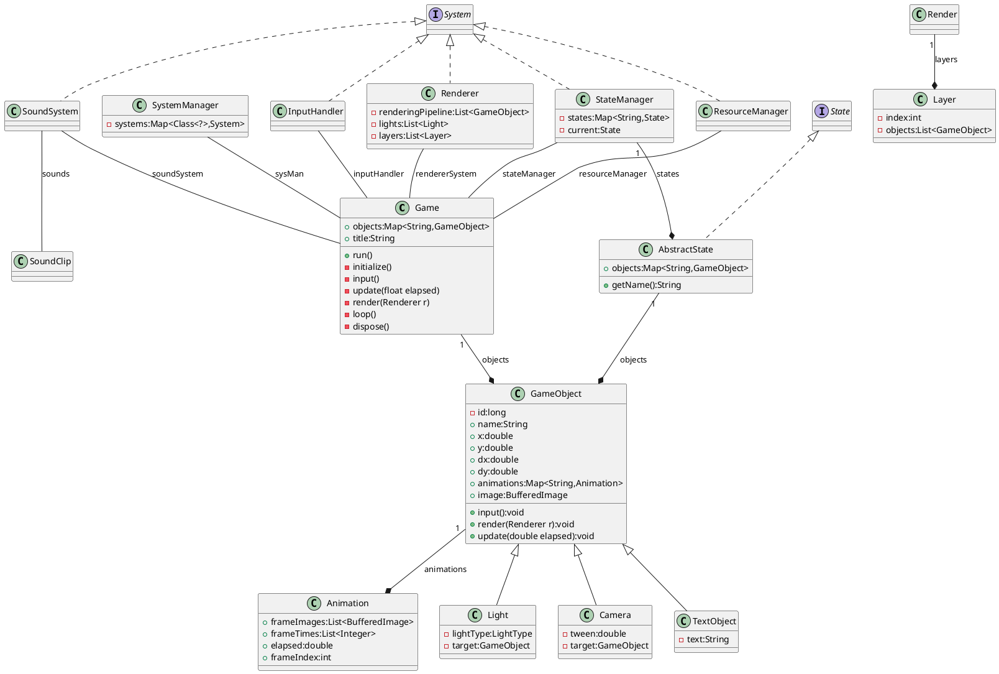

# Introduction

Demo Game is a small project to explore the java game development on the java AWT standard library.
Adding some just necessary outer libs, it will implement a 2D Platform engine to create Game.

Most of the game is out of configuration and some character and game-play behaviors must be coded with help of Java.

As a short introduction to what is going to happen here, a beautiful and complex UML class diagram is the best thing to have.

<figure>

<figurecaption>This is a draft of the global classes overview. It will be refined during the development process.</figurecaption>
</figure>

