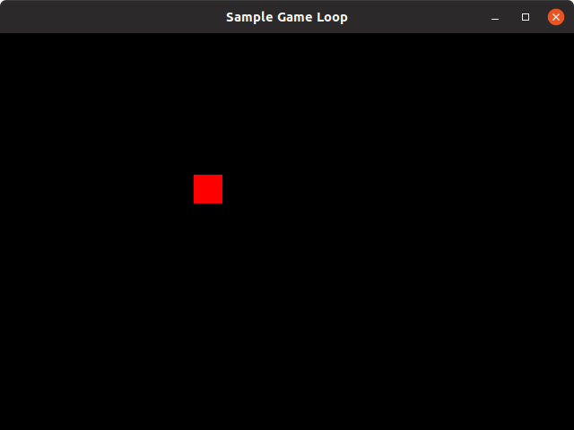
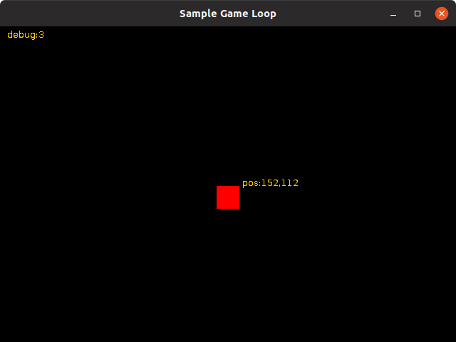

# The Game class

The Game is the entry point of our game. The main class is a frmework for all the game processing, from create window to animate all those beautiful sprites. Let's dive into this thing ! 

## ABC Loop !

The core routine of a game is a loop. 

This main loop will achieve multiple goals. 

1. **capture the control input** from the player, which keys are pressed, which are released, where is the mouse cursor, all those input will be useful to animate or move all the characters in that game. 

2. The first one consists in **updating all the entities** managed by the game, a player character, an enemy, a small item to be collected, all those little people need to be maintain and updated according to internal and player actions.

3. **draw the graphical parts** of the game. The updated items must be (or not, depending on their visibility) displayed on screen, and animated according to some rules.

And finally, restart at point 1, until the game end of the player clearly request to exit from the game.


The times displayed are standard ones, measured through numerous old games, and is a basic time stepping for capture, update and render  a game for a frame of 15 ms at 50 Frame Per Second.

> **Note** 
> At 60 FPS, the frame is 16 ms.

This Loop can be written as this synthetic algorithm :

```java
while(!exit){
  input();
  update(time);
  render();
} 
```

In a well formed Java class, let's name it `samples.SampleGameLoop`, we will create those methods:


```java
public class SampleGameLoop {
  private boolean exit = false;
  private long FPS = 60;
  
  public SampleGameLoop(String title, int w,int h, int s){
    ...
  }
  
  public void initialize(){...}
  
  public void run(){
    initialize();
    loop();
  }

  public loop(){
    long elapsed=0;
    long startTime=System.currentMillis();
    long lastTime=startTime;
    while(!exit){
      startTime = System.currentMillis();
      input();
      update(elapsed);
      render();        
      elapsed = startTime - lastTime;
      waitFrame(elapsed);
      lastTime = startTime;
    }
  }
  private void input(){...}
  private void update(long elapsed){...}
  private void render(){...}
  
  private void waitFrame(long e){...}
    
  public static void main(String[] argc){
    SampleGameLoop dm = new SampleGameLoop("Sample Game Loop",320,200,2);
    rm.run();
  }
}
```

The structure of this class is a basic for any game you would like to create.

You can notice a `wait()` method, to manage the frequency of `update(elapsed)` method.

First initialize things, then start looping. With such simple class we will incrementally create our platform game.

### Some Sample code

In a very simple game loop implementation, you can easily animate a bouncing square.

Let's explore the way JFrame window is used to create

```java
public class Game{
    JFrame frame;
    BufferedImage screenBuffer;
    
    int x=0; 
    int y=0;
    int dx=2; 
    int dy=2;
    Color color=Color.RED;
    ...
    
    public void update(int elapsed){
        x+=dx;
        y+=dx;
        if(x>screenBuffer.getWidth()){ x=screenBuffer.getWidth();dx=-dx;}
        if(y>screenBuffer.getHeight()){ x=screenBuffer.getHeight();dy=-dy;}
        if(x<0){ x=0;dx=-dx;}
        if(y<0){ y=0;dy=-dy;}
    }
    
    public void render(){
        Graphics2D g = (Graphics2D)screenBuiffer.getGraphics();
        g.setColor(Color.BLACK);
        g.fillRect(0,0,screenBuffer.getWidth(),screenBuffer.getHeight());
        
        g.setColor(color);
        g.fillRect(x,y,16,16);

        // render to screen
        Graphics2D sg = (Graphics2D) frame.getContentPane().getGraphics();
        sg.drawImage(screenBuffer, 
                     0, 0, 
                     screenBuffer.getWidth() * scale, 
                     screenBuffer.getHeight() * scale, 
                     0, 0,
                	 screenBuffer.getWidth(), 
                     screenBuffer.getHeight(), 
                     null);
		// ... debug info ...
    }
}
```

### Adding user interactivity

And we can add some interactivity by detecting some directional keys.

`UP`, `DOWN`, `LEFT`, and `RIGHT` keys will change speed value. but maximum limit value will be checked, the `maxD` set by default at 4. this will be updated on each Release event.

```java
public class Game implements KeyListener{
    int maxD = 4;
    ...
    public void keyPressed(KeyEvent e){
        // Nothing here
    }
    public void keyReleased(KeyEvent e){
        switch(e.getCode()){
            case VK_UP:
                dy=(dy<maxD?dy+1:dy);
                break;
            case VK_DOWN:
                dy=(dx>=-maxD?dy-1:dy);
                break;
            case VK_LEFT:
                dy=(dx>=-maxD?dy-1:dy);
                break;
            case VK_RIGHT:
                dy=(dy<maxD?dy+1:dy);
                break;
            //... other case ...
            default:
                break;
        }
    }
    public void keyInput(KeyEvent e){
        // Nothing here
    }
    ...
}
```

you can play this `SampleGameLoop.java` from the `src/test/samples` path by executing:

```bash
$> cd src/main/java/samples/
$> javac SampleGameLoop.java
$> java SampleGameLoop
```

you will certainly get window like this :



If you press 3 times the `D` key, some debugging information will be displayed.

