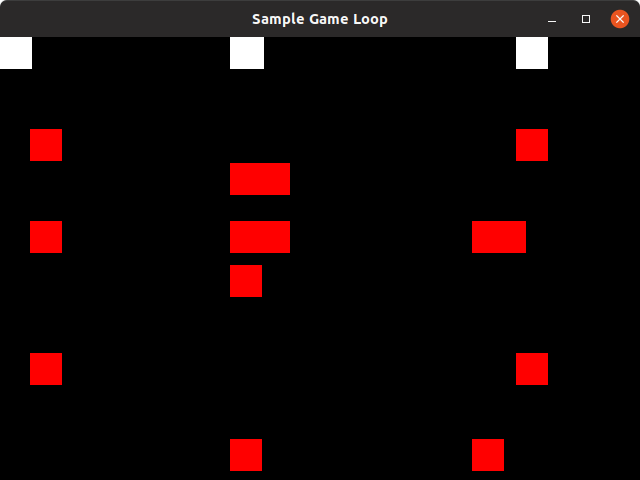
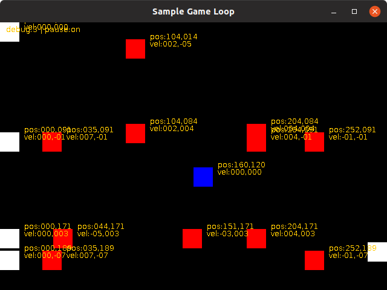
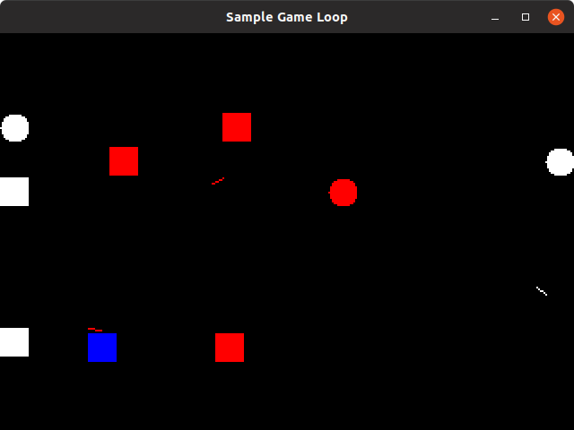
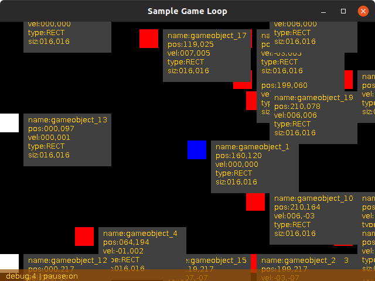
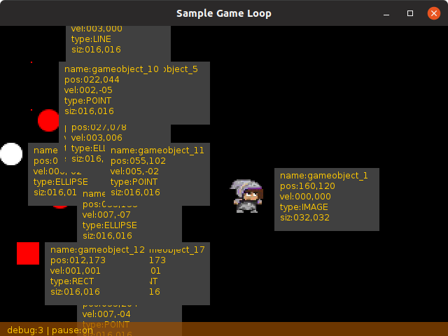
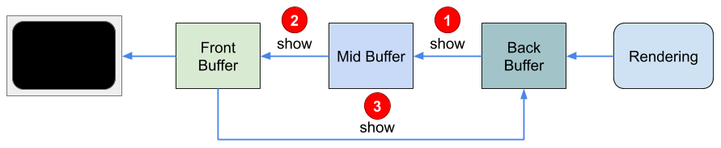
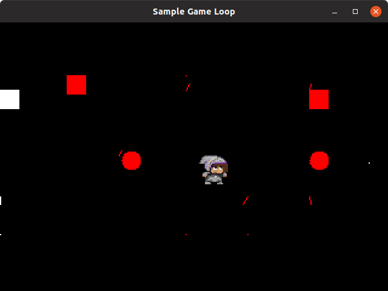
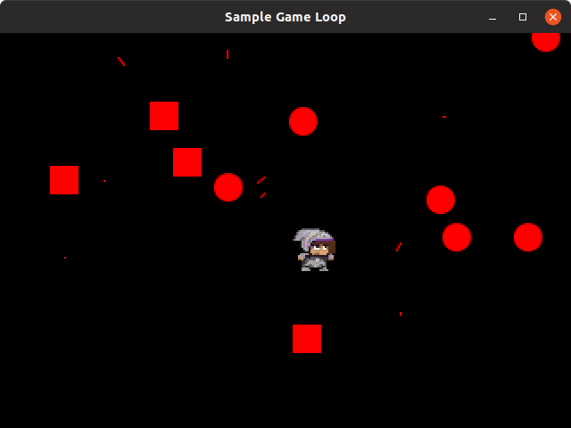

# GameObject

As introduced before, I talk about some entities managed by the game. This where the `core.object.GameObject` is going to play in the framwork.  

Any entity manage by the game,  the player character, the NPC (non playable characters), the score, the life, the all background display are objects in a game. The `core.object.GameObject` is going to be the core matter of the `core.Game`.

To be able to draw anything on screen, we will need for each object , a position, a size. We would need some other properties like an image of a color, a shape (square, circle, rectangle), and to be animated more new attributes we will discover later.

### Before enhancing our framework

In the previous `SampleGameLoop` example, we try to move a red square box from side to side. Let start from the requirement for this sample code:

- position(x,y)
- speed( dx,dy)
- color

#### GameObject class

All those  will be centralized into only one object, the `GameObject` class.

So, to start with sustainable things, create our class:

```java
public class GameObject {
	public int x;
	public int y;
	public int width;
	public int height;
	public int dx;
    public int dy;
    public Color color;   
    public int direction=1;  
}
```

Here are attributes:

| Attribute | description                         |
|-----------|-------------------------------------|
| x         | horizontal position                 |
| y         | vertical   position                 |
| dx        | horizontal velocity                 |
| dy        | vertical velocity                   |
| width     | width of object                     |
| height    | height of object                    |
| color     | draw color of object                |
| direction | moving direction (<0 left,>0 right) |

Now we have some attributes, we need to update and render things. In a common way to Object development, we need to specialized objects. In the previous sample, all things were performed by the main class. let's delegate some of the operations to this new `GameObject` class. The update process can be performed into the object itself, and the draw process so:

The update has 2 roles:

- update the object position (`x`,`y`) according to its velocity (`dx`,`dy`), 
- and update its `direction`.  it will be useful to define the sprite to be use for moving left or moving right. `direction>0` is moving right, else moving left.

```java
public void udpate(Game ga, long elapsed){
    x += dx;
    y += dx;
    // compute direction.
    direction=(dx>0?1:-1);
}
public void draw(Game ga, Graphics2D g){
    g.setColor(color);
    g.fillRect(x,y,16,16);
}
```

The main class now will just have to initialize a `GameObject` and delegate its update and its draw to.

```java
public class SampleGameObject {
  ...
  GameObject object;
  ...
  public void initialize(){
    objects = new GameObject();
  }
}
```

And now adapt update processing to objects update:

```java
void update(long elapsed){
    object.update(this, elapsed);
}
```
And adapt the rendering process:
```java
void render(Graphics2D g){
	object.draw(this, g);
}
```

Ok, we moved from a One big class to 2 smaller classes. But where are the benefits ? The impact of such class is louder if we decide to maintain multiple `GameObject` instances.

So let's manage more objects !

#### One class to rules them all

lets change a little bit our main class `SampleGameObject` by update some things.

First, replace the object  attribute by a more useful list of object:

```java
private List<GameObject> objects = new ArrayList<>();
```

And then modify the initialization, to add our object to the list:

```java
  public void initialize(){
    objects.add(new GameObject());
  }
```

And let's adapt the update and render methods:

```java
void update(long elapsed){
    for(GameObject go:objects){
        go.update(this, elapsed);
        constrainGameObject(this,go);
    }
}
void render(Graphics2D g){
    for(GameObject go:objects){
        go.draw(this, g);
    }
}
```

So, now, adding one or a dozen of `GameObject`, the main class `SampleGameObject` will remain the same (except the initialize method).

```java
  public void initialize(){
      createObjects(20);
  }

  protected void createObjects(int maxNbObjects){
      for(int i=0;i<maxNbObjects;i++){
          GameObject go = new GameObject()
          go.x = (int) Math.random() * (screenBuffer.getWidth() - 16);
          go.y = (int) Math.random() * (screenBuffer.getHeight() - 16);
          go.width = 16;
          go.height = 16;
          go.dx = (int) (Math.random() * 8);
          go.dy = (int) (Math.random() * 8);             
          objects.add(go);   
      }
  }
```

> **INFO**
> You can notice that the method `createObjects()` is protected for a future enhancement in next chapters.

Then run this sample code :

```bash
$> cd src/main/samples
$> javac SampleGameObject.java
$> java SampleGameObject
```

And you will get something like this :



#### Adding a Pause mode

We also create a small Pause mode by adding a pause boolean flag, changing its state with the `P` or the `PAUSE` key.

```java
public class SampleGameObject implements KeyListener{
	...
    // pause flag
    boolean pause = false;
    
    ...
    public void keyReleased(KeyEvent e) {
        GameObject go = objects.get(0);
        switch (e.getKeyCode()) {
			...
            case KeyEvent.VK_P:
            case KeyEvent.VK_PAUSE:
                pause = !pause;
                break;
            default:
                break;
        }
    }
    ...
    public void loop() {
        ...
        while (!exit) {
            nextTime = System.currentTimeMillis();
            if (!pause) {
                update(elapsed);
            }
            render();
            ...
        }
    }
    ...
}
```

So if you press a first  time the pause key, the update of all objects will stop. pressing the pause key again will restart the update process.

### Map of objects

There is a small difficulties in this approach, how to identify one particular `GameObject` in the list without maintaining some index values ? For this main reason, we are going to add a name to each of our object, and a mechanism to provide a default name for each of those.

First , extract the sub-class `GameObject` to a normal class, and then add the `name` attribute and the static `index` counter like bellow. 

The `GameObject()` constructor will initialize the default name for each object according to index value.

```java
public class GameObject {
    private static int index=0;
    String name;
    ...
        
    public GameObject(){
        name = "gameobject_"+(index++);
        ...
    }
    ...
}
```

And we need to replace our `GameObject`'s list in the `SampleGameObject` class with an other object list structure that allow us to retrieve directly an entity on its own name: a [`Map`](https://docs.oracle.com/javase/8/docs/api/java/util/Map.html "go and read the official JDK doc on Map object structure").

```java
public class SampleGameObject implements KeyListener {
    ...
    Map<String,GameObject> objects = new HashMap<>();    
    ...        
}
```

Then we need to adapt our code with this new Map. first the initialize() method:

```java
public void initialize(){
}
protected void createObjetcs(int maxNbObjects){
    for(int i=0;i<maxNbObjects;i++){
        GameObject go = new GameObject();
        ...
        objects.put(go.name,go);
    }
}
```

And the update processing must no more parse a list, but the map elements. We will get the  [`Map#values()`](https://docs.oracle.com/javase/8/docs/api/java/util/Map.html#values-- "what is exactly the values from a map ?") collection instead of direct objects attribute:

```java
public void update(long elpased){
    ...
    for(GameObject go: objects.values()){
        go.update(this,elapsed);
        ...
    }
} 
```

And finally, the rendering process must be also adapted to the Map values parsing:

```java
    
public void render(){
    Graphics2D g = ... ;
    ...
    for(GameObject go: objects.values()){
        go.draw(this,g);
        ...
    }
}
```

This will resulting in the same window display as previous version, but now we can get a particular `GameObject` directly from the map, without indexing list. Names are the index.

Just notice that we add a fancy feature to move one of the object, just press the SPACE bar to recenter the first object in the map, the one identify by the name '`gameobject_1`'. 

Then like in the previous ` SampleGameLoop` code, you can move this object according to the speed you set through the directional keys.



 ### Can we display an image ?

Until now, we only draw some rectangles as `GameObject`. It's now time to try some more fancy and interesting things. Let's add a `GameObjectType` to add new capabilities to our `GameObject` class. This `enum` will be added as an internal enumeration to `GameObject`.

First, we need to know what kind of things we will need to display. Maybe some squares, but also some ellipse as circle or dots, some point, some lines ?  and mainly some images. All the beautiful characters in games are images. So, to define properly this new `GameObject` type attribute, we need to define a new enumeration of possibilities:

```java
public enum GameObjectType{
    POINT,
    LINE,
    RECT,
    ELLIPSE,
    IMAGE;
}
```

With such type we may cover near all future cases.

So we now add the `type` attribute in the `GameObject` class:

```java
public class GameObject{
    ...
    GameObjectType type;
    ...
    public GameObject(){
        ...
        type=GameObject.RECT;
        ...
    }
}
```

Here we've define a default value to `RECT`, to get a rectangle as default type.

Now, we must adapt our `GameObject#draw()` method to take in account the type of object to render.

```java
public void draw(Game ga, Graphics2D g){
    g.setColor(color);
    switch(type){
        case POINT:
            g.drawLine(x,y,x,y);
            break;
        case LINE:
            g.drawLine(x,y,x+dx,y+dy);
            break;
        case RECT:
            g.fillRect(x,y,width,height);
            break;
        case ELLIPSE:
            g.fillEllipse(x,y,width,height);
            break;
        case IMAGE:
            break;            
    }
}
```

To get some demonstration of all those new object's types, let's introduce some randomness in our game initialization. We first need to randomly select a type of `GameObject`, we will delegate randomizing to the Java Math library `random()` method, generating positive float values:

```java
private GameObjectType randomType(){
    // all type but not IMAGE => max 4
    int vt = (int)(Math.random()*4);
    return GameObjectType.values()[vt];
}
```

and then call this `ramdomType()` from the `initialize()` phase:

```java
public void initialize() {
    collidingColor = Color.WHITE;
    squareColor = Color.RED;
    for (int i = 0; i < 20; i++) {
        GameObject go = new GameObject();
		...
        go.type = randomType();
        ...
    }
}
```

this is amazing, no ?



#### Getting better debug info

To get a better rendering of debug information, we update the `displayDebug()` method:

```java
private void displayDebug(Graphics2D sg, GameObject go) {
    Font f = sg.getFont().deriveFont(9);
    sg.setFont(f);
    FontMetrics fm = sg.getFontMetrics();
    int lineHeight = fm.getHeight();
    int xOffset = (go.x + go.width + 8);

    sg.setColor(Color.DARK_GRAY);
    sg.fillRect((xOffset-4) * scale, go.y * scale, 150, 6*lineHeight);

    sg.setColor(Color.ORANGE);
    sg.drawString(
        String.format("name:%s", go.name), 
        xOffset * scale,
        (go.y * scale) + (1 * lineHeight));
    sg.drawString(
        String.format("pos:%03d,%03d", go.x, go.y), 
        xOffset * scale,
        (go.y * scale) + (2 * lineHeight));
    sg.drawString(
        String.format("vel:%03d,%03d", go.dx, go.dy), 
        xOffset * scale,
        (go.y * scale) + (3 * lineHeight));
    sg.drawString(
        String.format("type:%s", go.type.name()), 
        xOffset * scale,
        (go.y * scale) + (4 * lineHeight));
    sg.drawString(
        String.format("siz:%03d,%03d", go.width, go.height), 
        xOffset * scale,
        (go.y * scale) + (5 * lineHeight));
}
```

this will produce a more pro look :

 ")

And the debug information line goes bottom screen. Just  isolate the draw-to-screen buffer method and modified the debug output:

```java
if (debug > 1) {
    for (GameObject go : objects.values()) {
        if (debug > 2) {
            displayDebug(sg, go);
        }
    }
	displayGlobalDebug(sg);
}
```

The `displayGlobalDebug()` is a simple drawing operations

```java
private void displayGlobalDebug(Graphics2D sg){
	sg.setColor(new Color(0.6f, 0.3f, 0.0f, 0.7f));
    sg.fillRect(0, frame.getHeight() - 20, frame.getWidth(), 20);
    sg.setColor(Color.ORANGE);
    sg.drawString(String.format("debug:%d | pause:%s", debug, (pause ? "on" : "off")), 10,
                  frame.getHeight() - 4);
}
```

This small piece of code will be rendered like bellow :




### Show me an image

Ok, so now we have some geometric shapes, we need some image display.

After generating so many `GameObject` with retrieve one of the generated object, change its type and define an image to be rendered.

```java
public void initialize() {
    ...
    try{
        BufferedImage sprites = ImageIO.read(
            this.getClass()
            .getResourceAsStream("/res/images/tileset-1.png"));

        GameObject player = objects.get("gameobject_1");
        player.type = GameObjectType.IMAGE;
        player.image = sprites.getSubimage(0,48,32,32);
        player.width = player.image.getWidth();
        player.height = player.image.getHeight();

    }catch(IOException ioe){
        log.error("unable to read the tileset image");
    }
}
```

As all the rest of the program is already design to render image, just run it.



### Flickering Effect

You certainly noticed the very "annoying eye effect" when rendering some debug text. All displayed strings are flickering. 

To remove this side effects, we are going to add some display buffers.  

This consists in memory buffers where the graphics are drawn while there are not displayed. Then, the buffer is displayed while another buffer is drawn by the rendering process. then switch between buffer and cycle continuously between all buffers.

The component managing buffer is the [`BufferStrategy`](https://docs.oracle.com/javase/8/docs/api/java/awt/image/BufferStrategy.html "go and read the buffer strategy docmentation") class.

Let's set an example with 3 buffers.



This will be implemented like this : first we setup the buffer strategy at `JFrame` creation:

```java
public SampleGameObject(String title, int width, int height, int s) {
	BufferStrategy bs = frame.getBufferStrategy();
    ...
        
    if (bs == null) {
        frame.createBufferStrategy(4);
    }
}
```

And then, during the phase we copy the back buffer to the screen, in fact we copy our rendered image to the current buffer. At end of rendering this buffer, we call the `show()` method to make the buffer switching.

```java
private void drawToScreen() {
        // render to screen
        BufferStrategy bs = frame.getBufferStrategy();
        Graphics2D sg = (Graphics2D) bs.getDrawGraphics();
        ...
        // drawing things
        ...
        bs.show();
    }
```

A screen capture will not show you how `BufferStrategy` is smoothing things.

### Anti-Aliasing

Rendering squares is  like rendering big pixels, a lot of sharp angles. But rendering some ellipses or circles and lines is not so visually good. You need to Smooth the output ;) This is exactly the role of the Anti-Aliasing mechanism from the `Graphics2D` API. This is accessible though the [`RenderingHints`](https://docs.oracle.com/javase/8/docs/api/java/awt/RenderingHints.html "Go and Read all secrets about the Rendering hints") filters.

at `render()` method:

```java
public void render() {

    Graphics2D g = (Graphics2D) screenBuffer.getGraphics();
    g.setRenderingHint(RenderingHints.KEY_ANTIALIASING,
                       RenderingHints.VALUE_ANTIALIAS_ON);
    g.setRenderingHint(RenderingHints.KEY_TEXT_ANTIALIASING,
                       RenderingHints.VALUE_TEXT_ANTIALIAS_ON);
	...
}
```

and then the `drawToScreen()` :

```java
private void drawToScreen() {
        ...
        if (debug > 1) {
            sg.setRenderingHint(RenderingHints.KEY_ANTIALIASING, RenderingHints.VALUE_ANTIALIAS_ON);
            sg.setRenderingHint(RenderingHints.KEY_TEXT_ANTIALIASING, RenderingHints.VALUE_TEXT_ANTIALIAS_ON);
           ...
        }
    	...
    }
```

This is now drawing in a better way :

* **without** anti-aliasing



* **with** anti-aliasing



We now can go to framework things by adding some just develop fancy objects.

## In our Framework

This new `GameObject` and its internal enumeration `GameObjectType` will go as is in the `core.object` package.

The latest version of the `SampleGameObject` class will be moved as the `Game` class into the core package.

```txt
src
|_ main
   |_ java
      |_ core
      |  |_ Game.java
      |_ object
         |_ GameObject.java
         |_ GameObjectType.java
```

It's time to go to the next chapter and decrypt what is a `System` and how to manage these new things.


