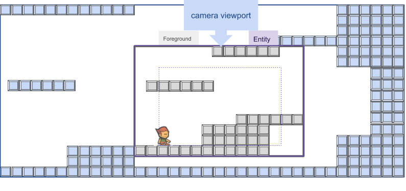

# Camera

One of the concept in a game is the `Camera`.  Like in movies, the player want to follow its character on the screen. 

Let's illustrate this concept: the full size of a level, an the area, the camera will show during the game; the viewport.

This rectangular area, according to the camera position will move by tracking the player moves. This is the way we want our camera to behave.



## Implementation

The way we will implement this behavior will consist in simulate a movie camera following the player's character moves.

But to make this more realistic, the camera will follow the player a small delay , as if an elastic was joining the character and the Camera. 

So the camera will obey to this simple math formula:

`pos += pos + (pos-target.pos)*tween*t`

Where `pos` is the camera position (as a 2D vector) and target the object to follow, so `target.pos` is the position 2d vector for the target to be followed, like the player character.
`tween` is the elastic factor for this camera. the more the fact reach 1 the faster the camera is to follow the target. the more the factor is near 0, the less the camera will be reactive to target movement.

The `Camera` will be a [`GameObject`](GameObject) like the other, but some `update(float)` method a little bit different:

```java
class Camera extends GameObject{
  public GameObject target;
  public float tween;
  public Rectangle viewport;

  ...
  void update(float elapsed){
    x += ((target.x + target.width - viewport.width * 0.5f) - x) * tween * elapsed;
    y += ((target.y + target.height - viewport.height * 0.5f) - y) * tween * elapsed;
  }
  ...

}
```

The position is relative to the player position, and the player is centered on the camera viewport. the tween (from 0.0 to 1.0) factor is used to delay the camera tracking move. 

[add an illustration]

the Game class must be updated:

```Java
class Game{
  ...
  public Camera camera;
  ...
  void Camera(float x, float y, target o, float tween){
    x=x;
    y=y;
    target=target;
    tween=tween;
  }
  ...
  public void render(Graphics2D r){
    if(camera!=null){
      g.translate(-camera.x, -camera.y);
    }

    ... rendering process...
 
    if(camera!=null){
      g.translate(camera.x, camera.y);
    }
  }
}
```

An enhance version of the camera would implements a zoom factor, to focus on a specific area, to show something to the player, focusing on a door, an object, an enemy.

This can be achieve by adding a double zoom attribute.

```java
public class Camera {
    ...
        double zoomFactor;
    ...
}
```

And in the rendering processing, add a scale action according to the zoomFactor value:

```java 
public class Game {
    ...
    public void render(){
        if(camera!=null){
            g.translate(-camera.x, -camera.y);
            g.scale(zoomFactor);
        }

        //... rendering process...

        if(camera!=null){
            g.scale(1/zoomFactor);
            g.translate(camera.x, camera.y);
        }
    }    
}
```

## In our Framework

Integrated in the final framework, the Camera object will reach the `core.object` package.

The `Game.render()` method will take in account the new `Camera` processing to move viewpoint to camera before rendering other objects.

