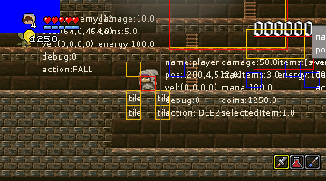

# Parsing command line

As we are opening a game, we certainly would like to define the size f the open window. a default value is provided, but it would be great to be able to define the size of such window.

An the better way consists in passing argument to the command line to set parameters for width, height and scale factor. It would be great also define if we want to open a window for the game, of open a full screen mode.

In a last step, we will define a default screen resolution to open in full screen mode.

## The command line

In the Java language, we can parse the arguments directly from the main() parameters.

Ans easy way will be to get parameters and test keys and values. But we are going to delegate this to a specialized component.

### How to parse ?

we received in the `main()` method an array of string corresponding to all arguments from command line. So, first establish a possible list of arguments, to prepare the parser to detect those arguments, and then start parsing.

At start time, the constructor is modified to pass argument array to the `CliManager`, the class to parse command line.

Find bellow the definition of those arguments:

| Attribute      | Class/Attribute   | Name             | Description                           |
| -------------- | ----------------- | ---------------- | ------------------------------------- |
| `d/debug`      | Sample#debug      | debug mode       | set the level of visual debug (0->5)  |
| `s/scale`      | Sample#scale      | pixel scale      | set the pixel scale (1->4)            |
| `w/width`      | Sample#width      | window width     | set the window Width                  |
| `h/height`     | Sample#height     | window height    | set the window Height                 |
| `fps`          | Sample#FPS        | rendered fps     | set the frame per second rate (30-60) |
| `f/fullscreen` | Sample#fullscreen | full screen mode | set window to fullscreen mode         |

## the CliManager

The `CliManager` class is the builder to define a list of possible argurments, and is the command line parser. 

A possible argument is designed as a `IArgParser` interface. this interface provides a list of method to describe this argument.

### IArgParser

The interface `IArgParser` is a contract to define each parser, even if type or argument to be parsed is `Integer`, `Float`, `String` or anything else.

```java
public interface IArgParser<T> {

    public boolean validate(String strValue);
    public T getValue();
    public String getShortKey();
    public String getLongKey();
    public String getName();
    public String getDescription();
    public String getErrorMessage(Object[] args);
    public T getDefaultValue();
    public T getMinValue();
    public T getMaxValue();
    public T[] getListOfValue();
}
```

### Manage all arguments

the contract for the `CliManager` is very simple, only a few methods are necessary to do the job.

* `add(IArgParser)` to add a new argument definition,
* `parse(String[] argc)` ...
* `get(String)` ...

*TODO*

```java
public class CliManager{
    // the parent Game
    private Sample game;
    // the map of arguments definition
    private Map<String, IArgParser<?>> argParsers = new HashMap<>();
    // the corresponding map values
    private Map<String, Object> values = new HashMap<>();

    CliManager(Sample g){
        this.game = g;
    }

    public void add(IArgParser<?> ap){
        // add a new argument parser
    }

    public void parse(String[] args){
        // parse the command line arguments.
    }

    public Object getValue(String key) ArgumentUnknownException {
        // return the value of the key parameter.
    }
}
```

### add(IArgParser)

the method to add anew parser is referencing another object which name is `IArgParser`.

The main things to define for an argument are:

- `shortKey` a short option name to define the argument,
- `longKey` a long option name to define the argument,
- `name` the real name of the argument,
- `description` the description of the argument,
- `defaultValue` a default value for the option for the argument,
- `min` a minimum value for the option for the argument,
- `max` a maximum value for the option for the argument,
- `listOfValues` a list of possible values for the argument.

Now that the contract exists, we will have to create some real Parser, like Integer parser, Float parser and an Array of integer parser.

- `IntArgParser` the implementation of a `IArgParser` for a command line option that is an `Integer` value,
- `IntArrayArgParser` the implementation of a `IArgParser` for a command line option that is an array of integer, `Integer[]` values,
- `FloatArgParser` the implementation of a `IArgParser` for a command line option that is an `Float` value,
- `StringArgParser` the implementation of a `IArgParser` for a command line option that is an `String` value.

So, starting the game, we need to add the `CliManager` initialization:

```java
class SampleCliManager extends SampleInputHandler {

    private CliManager clm;
    //...
    public SampleCliManager(String[] args) {
        this.title = title;
        configuraCliArguments();
        parseArgs(args);
        createWindow(title, width, height, (int) scale);
        //...
    }

}
```

Then, the  method `configurationArguments()` is where the arguments parser are defined.

```java
private void configArguments() {
    // Declare the CliManager (to parse arguments and extract valuable attributes with default values)
    clm = new CliManager(this);
    // Add debug attribute
    clm.add(
        new IntArgParser(
            "Debug", "d", "debug", 
            0, 0, 5, 
            "Define the Debug level to on screen display.",
            "%s set to %s is wrong, default value is %d and \
                can be between %d and %d"));
    ...
}
```

The `parseArgs(String[] args)` is requesting the arguments parsing to the CliManager, and retrieve the needed values for the game.

```java
private void parseArgs(String[] args) {
    clm.parse(args);
    try {
        debugMode = (Integer) (clm.getValue("Debug"));
        ...
        }
    } catch (ArgumentUnknownException e) {
        System.err.println(e.getLocalizedMessage());
    }
}
```

if you start the game with the following arguments :

```bash
$> java -jar target\BGF-x.y.z-shaded.jar -Dd=3 w=720 h=320 s=1.5
```

This will start the game with a 720x320 window size, a debug level set to 3 and a scale factor set to 1.5.

Pushing the `[d]` key, more debug information are displayed.




### IntArgParser a sample parser

Let's dive into some parser implementation, the `Integer` option parser:

```java
public class IntArgParser extends ArgParser<Integer> implements IArgParser<Integer> {

    public IntArgParser() {
        super();
    }

    public IntArgParser(
        String name,
        String shortKey,
        String longKey,
        int defaultValue,
        int min,
        int max,
        String description,
        String errorMessage) {
            super(name, shortKey, longKey, defaultValue, min, max, description, errorMessage);
    }

    @Override
    public boolean validate(String strValue) {
        value = defaultValue;
        try {
            value = parse(strValue);
            if ((min != null && value < min) || (max != null && value > max)) {
                errorMessage += String.format(
                        "value for %s must be between %s and %s. Value has been limited to min/max", name, min, max,
                        defaultValue);
                value = (value < min ? min : (value > max ? max : value));
            }
        } catch (Exception e) {
            value = defaultValue;
            errorMessage += String.format("value %s for argument %s is not possible.reset to default Value %s",
                    strValue, name, defaultValue);
            return false;
        }
        return true;
    }

    @Override
    public Integer parse(String strValue) {
        int value  = Integer.parseInt(strValue);
        return value;
    }

}
```

The constructor `IntArgParser(...)` is a simple tradition constructor with a bunch of parameters.

The most interesting part is the `validate(String)` and `parse(String)` methods.

- The `boolean IntArgParser#validate(String)` method will verify value range and set the default value in case of not matching parsed value.
- The `Integer IntArgParser#parse(String)` value will convert the resulting extracted value to the good targeted data type, in this specific case, `Integer`.

The last trick provided by the CliManager class is the help generator. This method will parse all arguments description and aggregate all those well fitted text to output as an help text.

```bash
$> java -jar target/BGF-x.y.z-shaded.jar h
Command Usage:
---------------
- [f / fps] : Define the frames per second ratio. ( min:30.0, max:60.0, default:60.0 )
- [h / height] : Define the height of the game window. ( min:80, max:480, default:200 )
- [s / scale] : Define the factor to be apply to pixel scale. ( min:1.0, max:4.0, default:2.0 )
- [w / width] : Define the Width of the game window. ( min:120, max:640, default:320 )
- [d / debug] : Define the Debug level to on screen display. ( min:0, max:5, default:0 )
```

