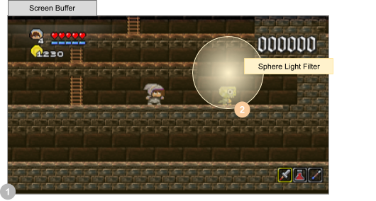
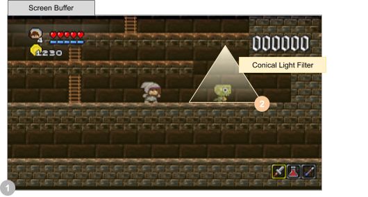

# Renderer

Even if we were delegating rendering to `GameObject`, we need some utilities and commons way to display things. The `Renderer` will be the library and the orchestrator of the rendering process.

The Renderer, as the mains rendering service will take the job to display everything in the game.

It will have its own `GameObject` rendering list, and perform some sort activities to get object from back layer to front one. This is achieve by using an internal Layer structure where each object is assign to.

The `GameObject` has a `layer` attribute defining to which of the layer the object is linked to, and in this layer, the attribute `priority` defines is rendering sort order.

According to these attributes, a layers list is created each time an object is added or removed from the rendering object list.

*Let's visit this incrrredible part of code !*

## Class structure 

First, this class implements the `System` interface, because, yes, it is a system managed by the `SystemManager` (sic).

```java
public class Renderer implements System {
    private BufferedImage screenBuffer;
    
    public Renderer(Game g){ ... }
    public void initialize(Game g){ ... }
	public void render(Game g,double elapsed){ ... }	    
}
```

This system has some public method:

* `Renderer(Game)` : the Renderer system constructor, 

- `initialize(Game)` : inherited from the System interface,

- `render(Game,double)`: the main processing for this renderer: display everything graphics.

## Renderer

The Renderer constructor is first initialize the Window where the game will be displayed.

```java
Renderer(Game g){
    super(g);
	jf = createWindow(g);
	screenBuffer = new BufferedImage( ... );
}
```

First delegate to the inherited `AbstractSystem` constructor some internal initialization. Then create the Window (a JDK [JFrame](https://docs.oracle.com/javase/8/docs/api/javax/swing/JFrame.html "see JFrame documentation in the Open JDK") is used to host the game display), and finally, create the screen buffer where all rendering and drawing will be performed, before refreshing real window frame.

### initialize(Game)

What is the initialize method is setting ?

```java
public void initialize(Game g){
    mapRenderer = new MapRenderer();
	return 0;
}
```

### add(GameObject)

Adding an object ? Yes, this is an unattended complex operation.

```java
public void add(GameObject go) {
    disptachToLayer(go);
    if (!go.child.isEmpty()) {
        putAll(go.child);
    }
}
```

First, this new `GameObject` must be dispatched in the right `Layer` entry. The is the `dispatchToLayer()` job.

Based on the `GameObject#layer` and `GameObject#priority` attributes, the `GameObject` is attached to a virtual Layer, identified by the layer value. If it does not already exists in th e Renderer layers list, it is created, and the object is attached to.

```java
private void disptachToLayer(GameObject go) {
    Layer l;
    if (layers.get(go.layer) == null) {
        l = new Layer();
        l.index = go.layer;
        if (go.fixed) {
            l.fixed = true;
        }
        layers.put(go.layer, l);
    }
    l = layers.get(go.layer);
    l.objects.add(go);
    Collections.sort(l.objects, new Comparator<GameObject>() {
        public int compare(GameObject g1, GameObject g2) {
            return g1.layer < g2.layer 
                ? -1 
                : (g1.priority < g2.priority 
                     ? -1 
                       : 1);
        }
    });
}
```

After each adding operation, the list of object for the targeted layer is completely sorted.


> **WARNING**
>
> A very important thing is about the `GameObject#fixed` attribute. If one of the object in the layer has the `fixed` attribute set to `true`, all the `Layer` is connected to the `Camera` moves. The `fixed` attribute is particularly useful to render screen fixed things like the HUD, some text message, or anything attached to the camera moves.


Then, is the object is a parent one, all its `child` objects are dispatched with a `putAll()`.

### render(Game, double)

Let's explore the first level of complexity of the render method.

From a small flag `renderingPause`, the display refresh is depending on (see `setPause()` for details).

In one of the next chapter, you will discover the power of [`Scene`](./03-scene_and_manager_system "read about Scene and their management") and their management. let's say that this Scene have an active [`Camera`](./05-camera.md "got and read about Camera").

To be able to smooth rendering of the really squared pixel, we activate the anti-aliasing [`RenderingHints`](https://docs.oracle.com/javase/8/docs/api/java/awt/RenderingHints.html "see what are rendering hints in the java jdk") on graphics but also on text. 

Then we clear the screen buffer with the most darker color we got: black.

and we will render all layered moving  objects according to the active camera position (the reason why the [`g.translate()`](https://docs.oracle.com/javase/8/docs/api/java/awt/Graphics2D.html#translate-double-double- "what is a Graphics2D#translate() operation ?") method are used.)

```java
public void render(Game dg, double elapsed){
    if (!renderingPause) {
			DebugInfo.debugFont = g.getFont().deriveFont(8.0f);

			Camera camera = dg.sceneManager.getCurrent().getActiveCamera();

			// activate Anti-aliasing for image and text rendering.
			g.setRenderingHint(
                RenderingHints.KEY_ANTIALIASING, 
                RenderingHints.VALUE_ANTIALIAS_ON);
			g.setRenderingHint(
                RenderingHints.KEY_TEXT_ANTIALIASING,
                RenderingHints.VALUE_TEXT_ANTIALIAS_GASP);

			// clear image
			g.setColor(Color.BLACK);
			g.fillRect(0, 0, dg.config.screenWidth, dg.config.screenHeight);
			for (Layer layer : layers.values()) {
				// if a camera is set, use it.
				if (camera != null && !layer.fixed) {
					g.translate(-camera.pos.x, -camera.pos.y);
				}
				renderObjects(dg, elapsed, g, camera, layer);
				// if a camera is set, use it.
				if (camera != null && !layer.fixed) {
					g.translate(camera.pos.x, camera.pos.y);
				}
			}

			// draw HUD
			dg.sceneManager.getCurrent().drawHUD(dg, this, g);
			// render image to real screen (applying scale factor)
			renderToScreen(dg, realFPS, realUPS);
		}
}
```

### renderObjects(...)

Where the magic happened !

the `renderObjects`w method is a private one. No way to call it from outside the Renderer.

The input attributes are a little bit numerous but all are necessary.

- The parent `game` Game
- the double  `elapsed` time since previous rendering (for future special rendering effects needs),
- The necessary [`Graphics2D`](https://docs.oracle.com/javase/8/docs/api/java/awt/Graphics2D.html "What is the Graphics2D java API and what is intend to ?")  `g` for this purely Java rendering implementation,
- The active `camera`, to correctly scope our rendering
- and the mandatory `layer` to render its own list of `GameObject`.

```java
private void renderObjects(Game game, double elapsed, Graphics2D g, Camera camera, Layer layer) {
		// draw all objects
		for (GameObject go : layer.objects) {
			if (go.enable && go.displayed) {
				if (go instanceof MapLevel) {
					// if MapLevel, delegates rendering operation to the MapRenderer.
					mapRenderer.render(game, g, (MapLevel) go, camera, elapsed);

				} else if (go instanceof TextObject) {
					TextObject to = (TextObject) go;
					drawText(game, g, to);

				} else if (go instanceof Light) {
					Light l = (Light) go;
					drawLight(game, g, l);

				} else if (go instanceof GameObject) {
					drawObject(game, g, go);
				}

				// if debug mode activated, draw debug info
				if (dg.config.debug > 2) {
					DebugInfo.displayCollisionTest(g, go);
					DebugInfo.display(g, go);
				}
			}
		}
	}
```

For one of the `layers` (some Renderer internal virtual group of `GameObject`  based on the `GameObject#layer` attribute) , parsing all objects, and according to `enable` and `displayed` flags, the `GameObject` is rendered.

The `renderObjects` method is delegating to the specialized  `drawXxxx(Game, Graphics2D, GameObject)` the draw processing of the object. It can a `MapLevel`, a `TextObject`, a `Light` or a basic `GameObject`.

In the particularly complex case of the `MapLevel` object, a specific renderer is provided, the `MapRenderer`. See the [`MapLevel`](09-maplevel "go and read quickly the MapLevel story") chapter for details.

> **NOTE**
> In a next release, this kind of object type based  processing will be implemented for all nature of `GameObject` child. An internal mechanism with delegate the rendering to a specialized renderer according to the `GameObject` child class.

And before processing the next object in the list,  if the graphical debug mode is activated (see the Config#debug attribute ) and debug level greater than 2, let's display fun debug information for the object.

#### drawText

*TODO*

#### drawLight

Drawing a light is a litle bit more complexe tan just drawing a rectanle or an image, we need to define how we want to draw the 3 kind of lights.

```java
private void drawLight(Game dg, Graphics2D g, Light l) {
		Composite c = g.getComposite();
		g.setComposite(AlphaComposite.getInstance(AlphaComposite.SRC_OVER, (float) l.intensity));
		switch (l.lightType) {
			case LIGHT_SPHERE:
                drawLightSphere(dg,g,l);
				break;
			case LIGHT_AMBIANT:
                drawLightAmbient(dg,g,l);
				break;
			case LIGHT_CONE:
				// TODO implement the CONE light type
				break;
		}
		g.setComposite(c);
	}
```

##### Spherical Light

Drawing a spherical Light is the easiest one. First, prepare a color gradient palette to draw some 2D ellipse, applying a mix between color gradient and transparency, to simulate Lightning. Here is the code.

Let's visit the [RadialGradientPaint](https://docs.oracle.com/javase/8/docs/api/java/awt/RadialGradientPaint.html "let's discover the Java RadialGradientPaint capanility") component provided by the JDK.

----

```
public final class RadialGradientPaint
extends MultipleGradientPaint
```

The `RadialGradientPaint` class provides a way to fill a shape with a circular radial color gradient pattern. The user may specify 2 or more gradient colors, and this paint will provide an interpolation between each color. 

 The user must specify the circle controlling the gradient pattern, which is described by a center point and a radius.  The user can also specify a separate focus point within that circle, which controls the location of the first color of the gradient.  By default the focus is set to be the center of the circle. 

 This paint will map the first color of the gradient to the focus point, and the last color to the perimeter of the circle, interpolating smoothly for any in-between colors specified by the user.  Any line drawn from the focus point to the circumference will thus span all the gradient colors. 

 Specifying a focus point outside of the radius of the circle will cause the rings of the gradient pattern to be centered on the point just inside the edge of the circle in the direction of the focus point. The rendering will internally use this modified location as if it were the specified focus point. 

 The user must provide an array of floats specifying how to distribute the colors along the gradient.  These values should range from 0.0 to 1.0 and act like keyframes along the gradient (they mark where the gradient should be exactly a particular color). 

 In the event that the user does not set the first keyframe value equal to 0 and/or the last keyframe value equal to 1, keyframes will be created at these positions and the first and last colors will be replicated there. So, if a user specifies the following arrays to construct a gradient:
 

```
     {Color.BLUE, Color.RED}, {.3f, .7f}
 
```

 this will be converted to a gradient with the following keyframes:

```
     {Color.BLUE, Color.BLUE, Color.RED, Color.RED}, {0f, .3f, .7f, 1f}
 
```

 The user may also select what action the `RadialGradientPaint` object takes when it is filling the space outside the circle's radius by setting `CycleMethod` to either `REFLECTION` or `REPEAT`. The gradient color proportions are equal for any particular line drawn from the focus point. The following figure shows that the distance AB is equal to the distance BC, and the distance AD is equal to the distance DE. 

  

 If the gradient and graphics rendering transforms are uniformly scaled and the user sets the focus so that it coincides with the center of the circle, the gradient color proportions are equal for any line drawn from the center. The following figure shows the distances AB, BC, AD, and DE. They are all equal. 

  

 Note that some minor variations in distances may occur due to sampling at the granularity of a pixel. If no cycle method is specified, `NO_CYCLE` will be chosen by default, which means the the last keyframe color will be used to fill the remaining area. 

 The colorSpace parameter allows the user to specify in which colorspace the interpolation should be performed, default sRGB or linearized RGB.  

 The following code demonstrates typical usage of `RadialGradientPaint`, where the center and focus points are the same: 

```
     Point2D center = new Point2D.Float(50, 50);
     float radius = 25;
     float[] dist = {0.0f, 0.2f, 1.0f};
     Color[] colors = {Color.RED, Color.WHITE, Color.BLUE};
     RadialGradientPaint p =
         new RadialGradientPaint(center, radius, dist, colors);
 
```

 This image demonstrates the example code above, with default (centered) focus for each of the three cycle methods: 

  

 It is also possible to specify a non-centered focus point, as in the following code: 

```
     Point2D center = new Point2D.Float(50, 50);
     float radius = 25;
     Point2D focus = new Point2D.Float(40, 40);
     float[] dist = {0.0f, 0.2f, 1.0f};
     Color[] colors = {Color.RED, Color.WHITE, Color.BLUE};
     RadialGradientPaint p =
         new RadialGradientPaint(center, radius, focus,
                                 dist, colors,
                                 CycleMethod.NO_CYCLE);
 
```

 This image demonstrates the previous example code, with non-centered focus for each of the three cycle methods: 

 

----

the basement for this light rendering is using the proposed code sample:

```java
Point2D center = new Point2D.Float(50, 50);
     float radius = 25;
     Point2D focus = new Point2D.Float(40, 40);
     float[] dist = {0.0f, 0.2f, 1.0f};
     Color[] colors = {Color.RED, Color.WHITE, Color.BLUE};
     RadialGradientPaint p =
         new RadialGradientPaint(center, radius, focus,
                                 dist, colors,
                                 CycleMethod.NO_CYCLE);
```

Then, this will be rendered like thi



1. the normal rendered screen buffer,
2. a ellipse with a radial gradient coloring.

And used in our code like in the following lines :

```java
public void drawLightSphere(Game dg, Graphics2D g, Light l){
    l.foregroundColor = brighten(l.foregroundColor, l.intensity);
    l.colors = new Color[] { l.foregroundColor,
                            new Color(l.foregroundColor.getRed() / 2,
                                      l.foregroundColor.getGreen() / 2,
                                      l.foregroundColor.getBlue() / 2,
                                      l.foregroundColor.getAlpha() / 2),
                            new Color(0.0f, 0.0f, 0.0f, 0.0f) };
    l.rgp = new RadialGradientPaint(
        new Point(
            (int) (l.pos.x + 
                   (20 * Math.random() 
                    * l.glitterEffect)),
            (int) (l.pos.y + 
                   (20 * Math.random() 
                    * l.glitterEffect))),
        (int) (l.size.x * 2), 
        l.dist, 
        l.colors);
    g.setPaint(l.rgp);
    g.fill(new Ellipse2D.Double(l.pos.x, l.pos.y, l.size.x, l.size.y));
}
```

##### Ambient Light

Drawing an ambient light consists in drawing a rectangle over the camera view-port with the needed transparency and a requested color.

What we want to achieve is to ass a layer all over the view-port to render a rectangle.


1. the normal rendered screen buffer, 
2. a transparent colored rectangle.


```java
private void drawLightAmbient(Game dg, Graphics2D g, Light l){
    final Area ambientArea = new Area(
    new Rectangle2D.Double(
        dg.sceneManager.getCurrent().getActiveCamera().pos.x,
        dg.sceneManager.getCurrent().getActiveCamera().pos.y,
        dg.config.screenWidth,
        dg.config.screenHeight));
    g.setColor(l.foregroundColor);
    g.fill(ambientArea);
}
```

##### Conic Light

The Cone light will come soon...

> **Note**
> The important thing to notice is in this particular case, we will render simple triangle to simulate a spot light.



1. the normal rendered screen buffer, 
2. a transparent vertical gradient colored triangle.

The corresponding code will be:

```java
private void drawCone(Game dg, Graphics2D g, Light l){
    ... TODO ...
}
```

Then we can go the the last but not least, rendering a `GameObject`.

#### drawObject

According to the object type, a rectangle, a circle or an image will be drawn.

Just notice that for image rendering, we take in account the "direction factor". according to the sign of this factor, the image will rendered directly or with a vertical symmetry. Mainly this correspond to the horizontal direction of the speed vector.

The fantastic code :

```java
	private void drawObject(Game dg, Graphics2D g, GameObject go) {
		switch (go.type) {
			case RECTANGLE:
				g.setColor(go.foregroundColor);
				g.fillRect((int) go.pos.x, (int) go.pos.y, 
                           (int) go.size.x, (int) go.size.y);
				break;
			case CIRCLE:
				g.setColor(go.foregroundColor);
				g.fillOval((int) go.pos.x, (int) go.pos.y, 
                           (int) go.size.x, (int) go.size.y);
				break;
			case IMAGE:
				if (go.direction < 0) {
					g.drawImage(go.image, 
                            (int) (go.pos.x + go.size.x), 
                            (int) go.pos.y, 
                            (int) (-go.size.x),
                            (int) go.size.y, null);
				} else {
					g.drawImage(go.image, (int) go.pos.x, (int) go.pos.y, 
                                (int) go.size.x, (int) go.size.y, null);
				}
				break;
		}
	}
```

Nothing special here, only using the Graphics2D API, but if you are curious, let's visit the [`drawImage()`](https://docs.oracle.com/javase/8/docs/api/java/awt/Graphics.html#drawImage-java.awt.Image-int-int-int-int-java.awt.image.ImageObserver-) official documentation:

----

```
public abstract boolean drawImage(Image img,
                                  int x,
                                  int y,
                                  int width,
                                  int height,
                                  ImageObserver observer)
```

Draws as much of the specified image as has already been scaled to fit inside the specified rectangle. 

The image is drawn inside the specified rectangle of this graphics context's coordinate space, and is scaled if necessary. Transparent pixels do not affect whatever pixels are already there. 

This method returns immediately in all cases, even if the entire image has not yet been scaled, dithered, and converted for the current output device. If the current output representation is not yet complete, then `drawImage` returns `false`. As more of the image becomes available, the process that loads the image notifies the image observer by calling its `imageUpdate` method. 

A scaled version of an image will not necessarily be available immediately just because an unscaled version of the image has been constructed for this output device.  Each size of the image may be cached separately and generated from the original data in a separate image production sequence.

- Parameters:

  `img` - the specified image to be drawn. This method does nothing if `img` is null.

  `x` - the *x* coordinate.

  `y` - the *y* coordinate.

  `width` - the width of the rectangle.

  `height` - the height of the rectangle.

  `observer` - object to be notified as more of                          the image is converted.

- Returns:

  `false` if the image pixels are still changing;           `true` otherwise.

----

