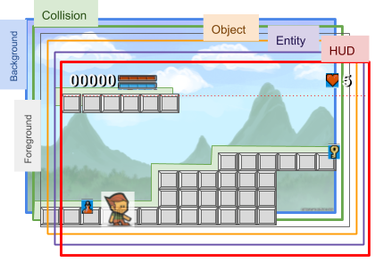

# Level, map and tiles

To get playable area in a platform game, we need to define finely the level design, the objects to be collected, the non player characters and the enemies, there characteristics and there position in the level.
We also need to be able to define the chains between each levels.

## What is a Level ?

A level is a composition of multiple layers of graphical and data objects.



Multiple layers are possible:

1. the background which is often a simple image,
2. A collision layer, where all the area where the player character can not move through are defined width only meta-data or geometrical shapes,
3. A foreground defining the decors, build upon tiles,
4. a layer dedicated to objects and items
5. And the main object layer where animated and interactive objects are defined, like enemies, player, door, etc..
6. And the last one, a fixed layer where player, quest, inventory and map informations are displayed.

All those data are a Level.

## How to implement it ?

To achieve those requirements, we need to implement some new objects and some files to define those values.

2 files will be defined:

- `asset_[99].json` to define objects to be used and displayed in the level map,
- `map_[99].json` the defintion of the layers of a map in a level.

where `[99]` is a simple number.

Let's dive in such definitions !

## What are the entities ?

To manage a `MapLevel`, we need some basic and some complex entities.
Any MapLevel is composed of some MapLayer's that can be tile map or image. An Asset is a list of pre-defined MapObject, a tile or a GameObject, with its own parameters. This MapObject will be referenced in a MapLayer's map with a simple character.

### map_\[99\].json

Let's dive into a sample to understand, here is a simple [map.json](resources/maps/map.json "open to see the json file") file.

The JSON structure is quite simple.

A first section defining the `name` of this map, and a short `description`.

```javascript
{
	"name": "Name of this level",
	"description": "A short description for this MapLevel.\nThis text can be displayed at start during 10 seconds, a default value",
```

the short decription will be displayed at level start, during a default delay of 10seconds. This can be changed by a parameter in the next "environment" section

This `environment` section can contains a bunch of thing like parameters for ambient light, gravity, etc...

> **NOTE**<br/> > _this section will be documented soon._

```javascript
	"environment": {
        "ambiantlight": {
			"color": [
				1.0,
				1.0,
				1.0
			],
			"intensity": 1.0
		},
        "physic":{
            "gravity":[0,-0.981],
            "wind":{
                "velocity":[-0.20,0],
                "randomFreq":0.26
            }
        }
     },
```

Then, the main part of the definition, the list of layers.

Here is a first layer as a simple image, the `type` attribute is set to `LAYER_BACKGROUND_IMAGE`.

Each layer has their own `name`, a display sort order `index`. Lower the value is, farer rendered it is. Then, the `background` attribute will define the path to the image to be used as a background.

```javascript
	"layers": {
		"background": {
			"name": "background",
			"index": "1",
			"type": "LAYER_BACKGROUND_IMAGE",
			"background": "/res/images/background-1.jpg"
		},
```

A second `MapLayer` named `mid` has `type` of `LAYER_TILEMAP` will render a real Map.

Based on some MapObject defined by one of the list of `MapObjectAsset` defined by the `assets` attribute the map will use a file `/res/assets/asset-2.json` as tile assets (a list of MapObject definition).

You can noticed the `index` fixed at value 2, it will be rendereed on top of the previous set MapLayer named `background`.

```javascript
		"mid": {
			"name": "mid",
			"index": "2",
			"type": "LAYER_TILEMAP",
			"assets": [
				"/res/assets/asset-2.json"
			],
			"map": [ ... ]
		},
```

And the latest MapLayer is like the previous one. Using the same asset to dipslay the tiles.

```javascript
		"front": {
			"name": "front",
			"index": "3",
			"type": "LAYER_TILEMAP",
			"assets": [
				"/res/assets/asset-2.json"
			],
			"map": [ ... ]
		}
```

And then, the `MapObjectAsset` definition is also a json file. Its structure is used to define each character as `MapObject`, used as tile in `MapLayer` map.

### asset_\[99\].json

Before diving into a `MapObject` defined into an `asset.json` file, you need to understand that each entity in this asset file is going to be interpreted as a simple tile, a basic graphical element to be displayed, a real `GameObject` like an enemy or the main player character, or an internal code to define some parameters for object `Behavior`.

This Behavior has been explained in a previous chapter, but, added to a specific asset definition and a GameObject, these code will help GameObject understand its environment to move on predefined some zone.

The specific characters '`[`' and '`]`' define a moving zone for the enclosed entity. This can delimit moves for an enemy.

#### Main Structure

The asset file has a first section, with a `name`, an `image` path for a file where the graphic parts of the tiles or `GameObject` are going to be extracted.

And a default tile size with a `tileWidth` and a `tileHeight`. And then all the `objects` aref defined.

```javascript
{
	"name": "Objects Set 1",
	"image": "/res/images/tileset-1.png",
	"tileWidth": 16,
	"tileHeight": 16,
	"objects": { ... }
}
```

Let's visit an objects list entry definition. 

#### Tile definition

Then let's see a MapObject to be a Tile

```javascript
"b": {
    "type": "TILE",
    "id": "b",
    "block": true,
    "offset": "17,8"
},
```

This MapObject is defining a simple `TILE`, with a specific capacity: it's `block`ing any other object. This is typically used for a brick tile.

#### Item definition

And the 2 following definitions of objects could be collectible by the player during the game.
Some characteristics of this object are going to be defined. The collected Object will be stored in the player inventory.

```javascript
"1": {
    "type": "ITEM",

    "name": "sword",
    "id": "1",
    "description": "sword-1",
    "usage": "weapon",
    "collectible": true,
    "damage": 10.0,
    "offset": "7,1"
},
```

The first one `1` is of type `ITEM`. it's a sword with some parameters giving a `damage` level of `10.0`.
An internal usage parameter tells us it is a `weapon`.

```javascript
"2": {
    "type": "ITEM",
    "name": "boost-energy",
    "id": "2",
    "description": "nrj-10",
    "usage": "health",
    "collectible": true,
    "energy": 10.0,
    "offset": "4,1"
},
```

This second one `2` is an `energy` boost of `10.0` points.
The usage parameter tells us it is a `health`.

You had noticed the attribute `"collectible":true`, telling the system that this `MapObject` can be collected by the player.

#### Animation definition

```javascript
"O": {
    "type": "OBJECT",
    "id": "O",
    "name":"coin",
    "description":"coins of 100 gold",
    "collectible": true,
    "money": 100,
    "frameSet": [
        "7,6,60",
        "8,6,60",
        "9,6,60",
        "10,6,60",
        "11,6,60",
        "10,6,60",
        "9,6,60",
        "8,6,60"
    ]
},
```
This latest one introduces another capability of configuration for an `OBJECT`, is can be animated. Based on some tiles in the image asset, you can list some `x,y,duration` int the `frameSet` attributes toi define each frame of an animation. 
`x,y` is  the offset of the tile in the image asset, and `duration` is the frame duration.

The `money` attribute define how many money this coin is.


```javascript
">": {
    "type": "TILE",
    "id": ">",
    "image": "pic-right.png",
    "hit": true,
    "damage": 10
},
```

#### Entity definition

This entry will be converted to a `GameObject` in our game, this is toled by the `clazz` attribute defining the implementation class.
`type` and `name` attribute define the king of entity.

```javascript
"E": {
    "id": "E",
    "type": "ENEMY",
    "name": "enemy_#",
    "clazz": "core.object.GameObject",
    "image": "todo",
    "offset": "6,1",
    "size": "32,32",
    "priority": 2,
    "layer": 2,
    "bbox": {
        "top": 8.0,
        "bottom": 0.0,
        "left": 4.0,
        "right": 4.0
    },
    "color": "RED",
    "canCollect": false,
    "attributes": {
        "energy": 100.0,
        "damage": 10.0,
        "coins": 5
    }
}
```

This big MapObject definition is an entity typed `ENEMY`. The `name` property is set to `enemy_#`. if you got multiple `E` in your MapLayer, you will get  `enemy_1̀`, `enemy_2`, `enemy_n`,...

The attribute `priority` is defining a sort order for objects rendering, to manage front/back rendering in the same MapLayer of multiple entities.

`bbox` attribute define the margin bounding box for this entity of type `ENEMY`. The `top`, `bottom`, `left` and `right` are all the side margin.

And `offset` and `size` attributes are defining the image offset in the asset and its size.

Virtual rendering `layer` are used to display the dynamic `GameObject`. the chosen layer for this Enemy is set to `2`.

An `attributes` map will define how to initialize the defaut value for the entity. in this entity, the `energy`, `damage` and `coin` value are set to `100.0`, `10.0` and `5`.

In the following entity, some specific behavior are scripted with LUA in the `scripts` list attribute:

```javascript
"F": {
    "id": "E",
    "type": "ENEMY",
    "name": "enemy_#",
    ...
    "attributes": {
        "energy": 100.0,
        "damage": 10.0,
        "coins": 5,
        "scripts":["/res/scripts/enemy_update.lua"]
    }
}
```

> **NOTE**<br>
> In a next version the specific `behaviors` attribute list will offer new capabilities in term of code. Some specific implementation of the `Behavior` java interface will describe how the entity must behave regarding some specific events.


#### Common Attributes

You had certainly notices some common attributes. Here are ther definitions.

| Attribute   | Json to Java format            | Description | Values |
|-------------|--------------------------------|-------------|--------|
| type        | text:TileType upper/lowercase  | Internal type of the object | `PLAYER` the game player,<br/> `ITEM` a collectible object,<br/> `OBJECT` an animated coin ,<br/> `LIGHT` a light in the map,<br/> `TILE` a simple graphics element,<br/> `ENEMY` an enemy.
| name        | text:String                    | the internal name for this MapObject, mainly for debug purpose. if a `_#` is added, the # will be automaticaly added replaced by an internal index | `"name":"player"`,<br/> `"name":"enemy_#"` |
| id          | number:int                     | internal identifier, use for technical purpose | 1...999 |
| description | text:String                    | a short description to helmp maintener/develop to understand the purpose | `"description":"any text"` |
| clazz       | text:String                    |the Java class to be instantiated for this entity | `"clazz":"core.entity.GameObject"`|
| usage       | text:String                    | not used today, only informal | `"usage":"simple_keyword"` |
| block       | boolean:Boolean                | set to true, the tile will block any object. | `"block":true`  |
| hit         | boolean:Boolean                | set to true, this tile will infict damage to an entity. | `"hit":true`  |
| canCollect  | boolean:Boolean                | the MapObject is an entity that can collect all object having the `collectible` capability | `"canCollect":true`|
| collectible | boolean:Boolean                | The object will be collectible by collectors entities| `"collectible":true` |
| offset      | text:int,int                   | coordinate in the asset image modulus tile size | `"offset":"1,17"` |
| size        | text:int,int                   | the size of the defined entity | `"size":"32,32"` |
| frameSet    | list:Map<String>               | you can list some `x,y,duration` in the `frameSet` attributes to define each frame of an animation.<br>The `x,y` couple is the offset of the tile in the image asset, and `duration` is the frame duration. | `"frameSet": ["7,6,60", "8,6,60", "9,6,60", "10,6,60", "11,6,60", "10,6,60", "9,6,60", "8,6,60" ]` |
| bbox        | text:BBox                      | `bbox` attribute define the margin bounding box of an entity. The `top`, `bottom`, `left` and `right` are all the side margin. | `"bbox": { "top": 8.0, "bottom": 0.0, "left": 4.0, "right": 4.0}` |
| damage      | number:double                  | This MapObject inflicts some damage to the player | `"damage":8.0` |
| energy      | number:double                  | The energy this MapObject will offer if collected. | `"energy":10.0` |
| money       | number:double                  | The money this map object will offer if collected. | `"money":5` |

### MapLevel

A `MapLevel` is a playground for a player, with one or more layers, and each `MapLayer` can be a tilemap or a simple image.
This MapLevel is read from a map file, where used asset and map are defined (see the [`MapReader`](the-map-reader) below for details).

### MapLayer

A map, defined in a `map_*.json` file is composed of one or more layer. Each layer can be map of ile or an image, and have their own size (rows, columns. The tiles and entities used are the one defined in an `asset_*.json` file.

### MapObjectAsset

The MapObjectAsset is the container for all the defined MapObject within asset_\[99\].json file.

### MapObject

A `MapObject` is the basic POJO with all attributes in public scope, defining an entry into an Asset. All the properties of this class are corresponding to all the listed attributes in the previously presented table.

### The Asset

An asset is a list of objects to be use (and reuse) in some map levels. Those defined objects will be dispatch through all the layers, according to their type and renderer according to their priority.

## The MapReader

The `MapReader` is the builder to read a map_\[99\].json file and organize all tiles, items, objects and entities in to a `MapLevel` to be played with.


## The MapRenderer

TODO
